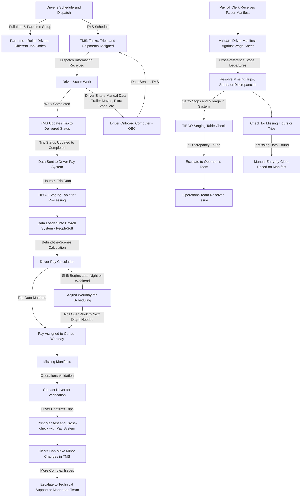

```mermaid
graph TD
    A[Driver's Schedule and Dispatch]
    A -->|Full-time & Part-time Setup| B[Part-time - Relief Drivers: Different Job Codes]
    A -->|TMS Schedule| C[TMS: Tasks, Trips, and Shipments Assigned]
    C -->|Dispatch Information Received| D[Driver Starts Work]
    
    D -->|Work Completed| E[TMS Updates Trip to Delivered Status]
    E -->|Trip Status Updated to Completed| F[Data Sent to Driver Pay System]
    
    F -->|Hours & Trip Data| G[TIBCO Staging Table for Processing]
    G --> H[Data Loaded into Payroll System - PeopleSoft]
    
    H -->|Behind-the-Scenes Calculation| I[Driver Pay Calculation]
    I -->|Trip Data Matched| J[Pay Assigned to Correct Workday]
    
    %% Payroll Clerk Process
    K[Payroll Clerk Receives Paper Manifest]
    K --> L[Validate Driver Manifest Against Wage Sheet]
    L -->|Cross-reference Stops, Departures| M[Resolve Missing Trips, Stops, or Discrepancies]
    M -->|Verify Stops and Mileage in System| N[TIBCO Staging Table Check]
    N -->|If Discrepancy Found| O[Escalate to Operations Team]
    
    O --> P[Operations Team Resolves Issue]
    
    %% Handling Manual Data Entry
    D -->|Driver Enters Manual Data - Trailer Moves, Extra Stops, etc| Q[Driver Onboard Computer - OBC]
    Q -->|Data Sent to TMS| C
    
    %% Resolving Payroll Discrepancies
    M --> R[Check for Missing Hours or Trips]
    R -->|If Missing Data Found| S[Manual Entry by Clerk Based on Manifest]
    
    %% Handling Late-night and Weekend Shifts
    I -->|Shift Begins Late-Night or Weekend| T[Adjust Workday for Scheduling]
    T -->|Roll Over Work to Next Day if Needed| J
    
    %% Missing Manifests Handling
    J --> U[Missing Manifests]
    U -->|Operations Validation| V[Contact Driver for Verification]
    V -->|Driver Confirms Trips| W[Print Manifest and Cross-check with Pay System]
    
    %% Payroll Clerk Limitations
    W --> X[Clerks Can Make Minor Changes in TMS]
    X -->|More Complex Issues| Y[Escalate to Technical Support or Manhattan Team]
```
